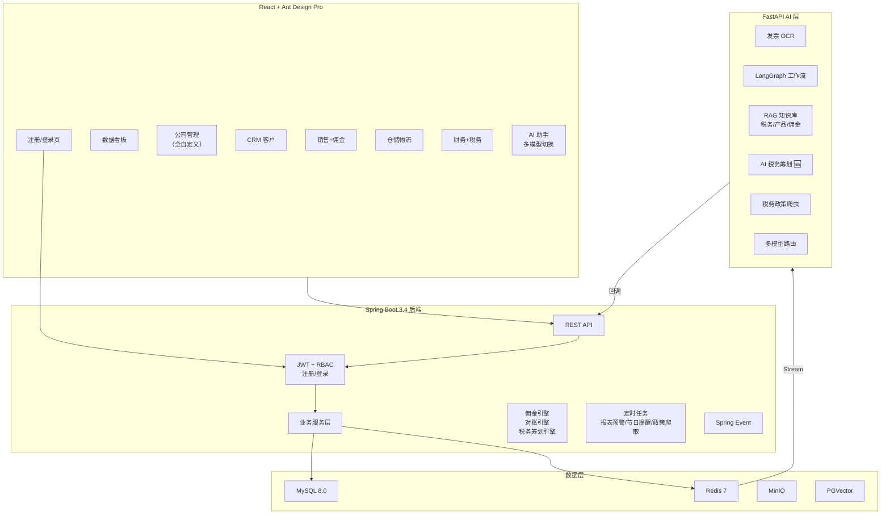
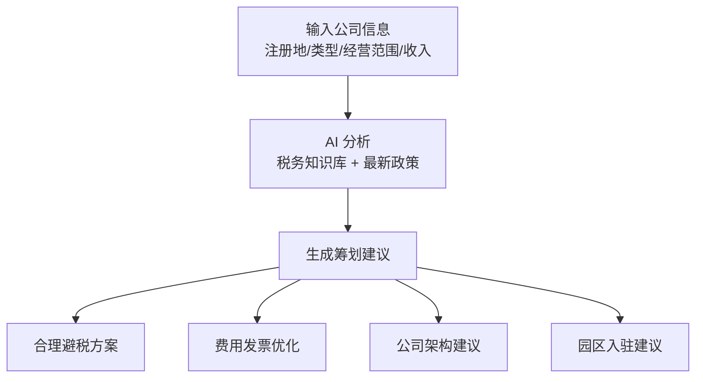
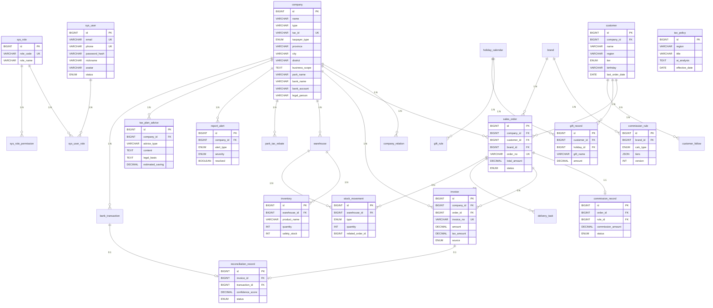

# DunFang BizHub — 顿方商业智能平台（最终版 v3）

## 已确认决策

| 项目 | 决定 |
|------|------|
| 名称 | DunFang BizHub |
| 公司信息 | **全部用户自定义**（名称/类型/地点/经营范围/税务属性，支持随时新增公司） |
| 后端 | Spring Boot 3.4 + MyBatis-Plus + Java 21 |
| 前端 | React + Ant Design Pro，含注册登录页面 |
| AI | 阿里 DashScope 为主，前端支持切换多家模型（小米等） |
| OCR | PaddleOCR 本地（RTX 4060 8GB） |
| 路径 | `e:\my_project\DunFangBizHub\` |

---

## 业务全景

```
用户自定义的主体公司（如：XX贸易有限公司）
│
├── 【公司管理】 ← 全部字段用户自定义
│   ├── 随时新增/编辑公司（主体/开票/分支）
│   ├── 注册地 → 自动关联对应地区税务政策
│   ├── 经营范围 → 影响可开发票类目
│   └── 园区归属 → 关联返税政策
│
├── 【销售线】
│   ├── 客户管理 + CRM + AI 客户开发
│   ├── 节日送礼记录与智能提醒
│   ├── 订单管理 + 佣金自动计算
│   └── 销售分析与趋势预测
│
├── 【供应链】
│   ├── 仓储管理（库存/出入库/盘点）
│   ├── 采购管理（AI 建议何时向供应商进货）
│   └── 物流调度（合理送货时间安排）
│
├── 【财务线】
│   ├── 多公司开票管理
│   ├── AI 发票识别（OCR + LLM）
│   ├── 智能对账（发票 vs 银行流水）
│   ├── 月度报表提交预警
│   ├── 税务政策智能追踪（按注册地差异化）
│   ├── 园区返税管理
│   └── 🆕 AI 税务筹划（合理避税 + 费用优化）
│
├── 【认证系统】
│   ├── 🆕 用户注册（邮箱/手机号）
│   ├── 🆕 用户登录（JWT）
│   └── 角色权限（管理员/销售/财务/仓管）
│
└── 【AI 智能层】
    ├── 多模型切换（阿里/小米/Ollama）
    ├── RAG 知识库（税务政策/产品手册/佣金规则）
    ├── ReAct Agent（智能问答）
    └── LangGraph 工作流（发票/对账/客户分析/税务筹划）
```

---

## 技术架构



---

## 十大功能模块

### 模块 1：用户认证系统 🆕

| 功能 | 说明 | 技术 |
|------|------|------|
| 注册 | 邮箱/手机号注册，密码加密 | BCrypt + 验证码 |
| 登录 | JWT 双 Token（access + refresh） | Spring Security |
| 角色管理 | 管理员/销售/财务/仓管 | RBAC 权限模型 |
| 个人设置 | 修改密码、头像、通知偏好 | — |

前端页面：
- `/login` — 登录页（邮箱+密码，记住我）
- `/register` — 注册页（邮箱/手机+密码+确认密码+邀请码）
- 登录后跳转 Dashboard

---

### 模块 2：多公司管理（全字段用户自定义）

> [!IMPORTANT]
> 公司的**一切信息**都由用户自行定义和维护，系统不预设任何公司数据。

| 字段 | 说明 | 为什么重要 |
|------|------|-----------|
| 公司名称 | 用户自定义 | 显示和报表 |
| 公司类型 | 主体/开票/分支/合作方（可扩展枚举） | 决定业务流 |
| 统一社会信用代码 | 税号 | 开票和税务 |
| 注册地址 | 省/市/区（关联地区税务政策） | **不同注册地税务政策不同** |
| 经营范围 | 文本描述（影响可开票类目） | 税务合规 |
| 所属园区 | 如在园区，关联返税政策 | 园区返税计算 |
| 纳税人类型 | 一般纳税人/小规模纳税人 | 税率不同（13% vs 3%） |
| 开户银行 + 账号 | 银行信息 | 对账和结算 |
| 法定代表人 | — | 合同和法务 |
| 联系方式 | 电话/邮箱 | 日常沟通 |
| 公司状态 | 正常/注销/迁移中 | 状态管理 |

```sql
company (
    id BIGINT PK,
    name VARCHAR(200),              -- 用户自定义名称
    short_name VARCHAR(50),         -- 简称
    type VARCHAR(50),               -- 用户自定义类型（可扩展）
    tax_id VARCHAR(50) UNIQUE,      -- 统一社会信用代码
    taxpayer_type ENUM('GENERAL','SMALL_SCALE'),  -- 一般/小规模
    province VARCHAR(50),           -- 省
    city VARCHAR(50),               -- 市
    district VARCHAR(50),           -- 区
    address VARCHAR(500),           -- 详细地址
    business_scope TEXT,            -- 经营范围
    park_name VARCHAR(200),         -- 所属园区（可空）
    bank_name VARCHAR(200),         -- 开户银行
    bank_account VARCHAR(50),       -- 银行账号
    legal_person VARCHAR(50),       -- 法定代表人
    contact_phone VARCHAR(20),
    contact_email VARCHAR(100),
    status VARCHAR(20) DEFAULT 'ACTIVE',
    remark TEXT,
    created_by BIGINT,
    created_at DATETIME,
    updated_at DATETIME
)

company_relation (
    id BIGINT PK,
    parent_company_id BIGINT FK,
    child_company_id BIGINT FK,
    relation_type VARCHAR(50),      -- 用户可自定义关系类型
    relation_desc VARCHAR(200),     -- 关系描述
    effective_date DATE,
    expire_date DATE
)
```

**支持随时新增公司**：用户可以在任何时候新增一家公司，系统会自动根据注册地匹配税务政策。

---

### 模块 3：销售佣金引擎

| 功能 | 技术点 |
|------|--------|
| 灵活佣金规则（用户自行配置） | 策略模式 + JSON 规则存储 |
| 固定费率 / 阶梯 / 固定金额 | 三种策略实现 |
| 规则快照 | 变更不影响历史数据 |
| 自动触发 | 订单确认 → Spring Event → 佣金计算 |

---

### 模块 4：CRM 客户开发 + 节日送礼

#### 4.1 AI 客户开发

| 功能 | AI 技术 |
|------|---------|
| 客户画像 | LLM 分析历史订单 |
| 潜在客户推荐 | RAG + 行业知识库 |
| 流失预警 | 定时任务 + 规则 |
| 拜访建议 | LLM 综合分析 |

#### 4.2 节日送礼

| 功能 | 说明 |
|------|------|
| 节日日历 | 法定节日 + 自定义（客户生日等） |
| 送礼规则 | 按客户等级配置预算 |
| 提前提醒 | 节前 7/3/1 天推送 |
| 效果追踪 | 送礼后订单变化分析 |

---

### 模块 5：仓储物流

| 子模块 | 功能 |
|--------|------|
| 仓库管理 | 多仓库、库位、库存台账 |
| 出入库 | 采购入库、销售出库、退货 |
| 库存预警 | 低于安全库存自动提醒 |
| AI 采购建议 | 基于销售趋势预测何时进货 |
| 送货调度 | 送货任务、路线建议、状态追踪 |

---

### 模块 6：AI 发票识别

```
上传发票图片 → PaddleOCR 提取文字 → LLM 结构化抽取 → 匹配订单 → 推荐科目
```

---

### 模块 7：税务智能 + 报表预警

#### 7.1 税务政策追踪（按注册地差异化）

系统根据每家公司的**注册地（省/市/区）**自动匹配对应地区的税务政策。

| 功能 | 说明 |
|------|------|
| 国家政策 | 全国通用的税务政策 |
| 地方政策 | 按省/市区分的地方税务优惠 |
| 园区政策 | 特定园区的返税政策 |
| 变更推送 | 新政策发布后自动通知 |

#### 7.2 AI 税务筹划 🆕

> [!IMPORTANT]
> **核心 AI 亮点**——智能税务优化建议



| AI 筹划场景 | 说明 | 示例 |
|------------|------|------|
| **费用发票优化** | 哪些日常开支可以合规地计入公司成本 | "业务招待费可按60%扣除，上限为收入的5‰" |
| **纳税人类型选择** | 一般纳税人 vs 小规模的利弊分析 | "年销售额低于500万，小规模可享3%征收率" |
| **区域税收优惠** | 不同注册地的税收优惠政策 | "某园区增值税地方留存50%返还" |
| **成本费用归集** | 车辆、办公、通讯等费用的合规入账方式 | "公司名下车辆加油费、保险费可全额抵扣" |
| **多公司架构优化** | 主体+开票公司的最优架构建议 | "开票公司注册在有返税的园区更优" |
| **季度预缴优化** | 合理安排收入确认时间 | "大额收入可考虑跨期确认" |
| **进项发票管理** | 确保进项充足，降低税负 | "本月进项不足，建议提前采购备货" |

> [!WARNING]
> **合规声明**：所有建议基于公开税务法规，标注法律依据，仅供参考，不构成专业税务意见。系统会在每条建议上附注相关法规条文。

核心表：
```sql
tax_plan_advice (
    id BIGINT PK,
    company_id BIGINT FK,
    advice_type VARCHAR(50),        -- 费用优化/架构建议/园区建议/...
    title VARCHAR(200),
    content TEXT,                    -- AI 生成的建议内容
    legal_basis TEXT,                -- 法律依据（税法条文）
    estimated_saving DECIMAL(12,2), -- 预估节税金额
    risk_level ENUM('LOW','MEDIUM','HIGH'),
    model_used VARCHAR(50),         -- 使用的 AI 模型
    status ENUM('PENDING','ADOPTED','DISMISSED'),
    created_at DATETIME
)
```

#### 7.3 月度报表预警

每月自动检查：未开票订单、未匹配发票、未结算佣金、税负率异常、库存盘点、申报截止日。

---

### 模块 8：智能对账

银行流水导入 → 模糊匹配发票 → LLM 辅助判断 → 异常标记

---

### 模块 9：AI 助手 + 多模型切换

| 模型 | 来源 | 用途 |
|------|------|------|
| qwen3-plus | 阿里 DashScope | 主力推理 |
| qwen3-flash | 阿里 DashScope | 轻量抽取 |
| qwen-vl | 阿里 DashScope | 发票图片 |
| MiLM | 小米 | 备选 |
| Ollama 本地 | gemma4/qwen3 | 离线降级 |

前端模型选择器：用户可在 AI 对话界面切换模型。

**AI 助手示例对话**：
- "我新注册的公司在某某园区，能享受什么返税政策？"
- "车辆加油费和保养费怎么入公司的账？需要什么手续？"
- "本月还有哪些发票没入账？离报表截止还有几天？"
- "替捷的XX型号库存快不够了，建议什么时候下采购单？"

---

### 模块 10：数据看板

销售看板 / 佣金看板 / 库存看板 / 财务看板 / CRM 看板 / 预警中心，ECharts 可视化。

---

## 完整 ER 图



---

## 项目目录结构

```
DunFangBizHub/
├── dunfang-backend/
│   └── src/main/java/com/dunfang/bizhub/
│       ├── common/          # Result/Exception/Config
│       ├── security/        # JWT + RBAC + 注册登录
│       ├── company/         # 多公司管理（全自定义）
│       ├── brand/           # 品牌管理
│       ├── customer/        # 客户管理
│       ├── crm/             # CRM + 节日送礼
│       ├── sales/           # 销售订单
│       ├── commission/      # 佣金引擎（策略模式）
│       ├── warehouse/       # 仓储管理
│       ├── logistics/       # 物流调度
│       ├── invoice/         # 发票管理
│       ├── finance/         # 对账 + 报表
│       ├── tax/             # 税务政策 + 筹划 + 预警
│       ├── ai/              # AI 集成层
│       └── dashboard/       # 数据看板
│
├── dunfang-ai/              # Python AI 服务
│   ├── workflows/           # LangGraph 工作流
│   ├── rag/                 # RAG 知识库
│   ├── ocr/                 # PaddleOCR
│   ├── tax_planner/         # AI 税务筹划 🆕
│   ├── crawler/             # 税务政策爬虫
│   └── models/              # 多模型路由
│
├── dunfang-frontend/        # React + Ant Design Pro
│   └── src/pages/
│       ├── Login/           # 登录页 🆕
│       ├── Register/        # 注册页 🆕
│       ├── Dashboard/       # 数据看板
│       ├── Company/         # 公司管理
│       ├── Sales/           # 销售+佣金
│       ├── CRM/             # 客户+送礼
│       ├── Warehouse/       # 仓储物流
│       ├── Finance/         # 财务+发票+对账
│       ├── Tax/             # 税务+筹划
│       └── AIAssistant/     # AI 助手
│
├── docker-compose.yml
└── README.md
```

---

## 开发阶段

| Phase | 内容 | 核心交付 |
|-------|------|---------|
| **1** | 基础框架 + 认证 + 多公司 + 销售 + 佣金 | 前端登录注册 + 后端骨架 + 佣金引擎 |
| **2** | CRM + 节日送礼 + 仓储 + 物流 | 客户开发 + 库存管理 + 采购建议 |
| **3** | 发票 + AI OCR + 智能对账 | PaddleOCR + LangGraph 对账 |
| **4** | 税务智能 + 筹划 + 报表预警 | AI 避税建议 + 政策追踪 + 预警 |
| **5** | AI 助手 + 多模型 + 数据看板 | RAG 问答 + ECharts 可视化 |

---

## 面试亮点总结

| 维度 | 亮点 |
|------|------|
| **业务真实性** | 来源于真实家族企业痛点，非教程项目 |
| **后端深度** | 佣金策略引擎、多公司架构、RBAC、事件驱动 |
| **AI 广度** | OCR、LangGraph、RAG、ReAct、多模型、税务筹划 |
| **工程完整度** | Docker、Flyway、CI/CD、测试金字塔 |
| **业务复杂度** | 多公司对账、阶梯佣金、跨地区税务差异 |
